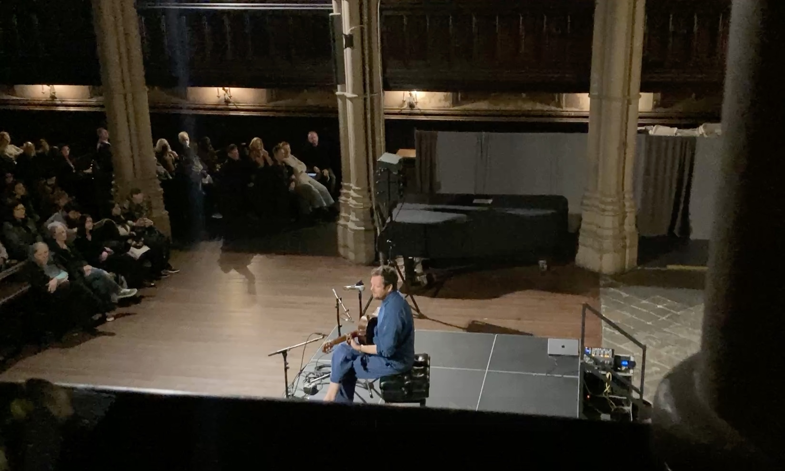

先週の金曜の一番入りたい会社のテクニカル面接(アルゴリズム)はうまく行った。なんの問題もなく、中くらいの程度の難易度の問題を解かされて、空間複雑度、時間複雑度(日本語合っているのかわからない、Complexityのこと)を聞かれたり、最適化できるところはないか、と聞かれるような普通の試験だった。ちゃんとコミュニケーションも取れたし、インタビュアーもいい人だったので大丈夫だろうと、すぐに思った。月曜にはCongratulation!とメールが来ていた。この会社の次の面接はバーチャルなオンサイト面接で、来週の月曜は朝10時から夕方５時までみっちり５回のかなり高度な面接が目白押しのハードなやつ。あー大変、そしてこの会社に入りたい。

そして今週の金曜はAIのスタートアップのバーチャルではないオンサイト面接があった。この会社は３番目に入りたい会社。でも入ったら、多分給料だいぶ下がる。朝の10時にマンハッタンのオフィスに行くと、オフィスのツアーをちょっとしてもらって、その日１日かけて実装するプロジェクトの課題を渡された。それをみた時は、あー簡単で典型的なフロントエンドのプロジェクトだな、と思って、よかったー、って感じだった。その間に２回の行動面接があって、さらに途中のランチも二人のバックエンドエンジニアと面接しながら食事みたいな感じだった。会社は終始フレンドリーでとてもいい雰囲気だと思った。そして実装したものを最後にプレゼンして、QAセッションをして終わり。今年で一番疲れた、ほんとに。。。多分、全部うまく行った、と思う。。。

その後、ブルックリンでコンサートの予約をしているというので待ち合わせをしてコンテンポラリーなギターの独奏のコンサートで少し癒されたけど、疲れは次の日にも残っていた。

その１日の間に、メールが来ていてもう一つの２番目に入りたいと思っていた会社の面接もスタートした。明日最初のテクニカル面接がある。

そして、明後日にはもう一つのちょっと有名なアプリの会社のCEOとの面接。ここは入りたい気持ちがあるのか自分でもわからない。

なにもまだいい結果来ていないけど、順調な気もする。もっとGoogleとかで働いていた優秀なエンジニアでも200個応募して、2つの会社としか面接に辿り着けていない、という話もこの前聞いたので、だいぶいい方だと思う。

まだまだ、頑張るぞ。