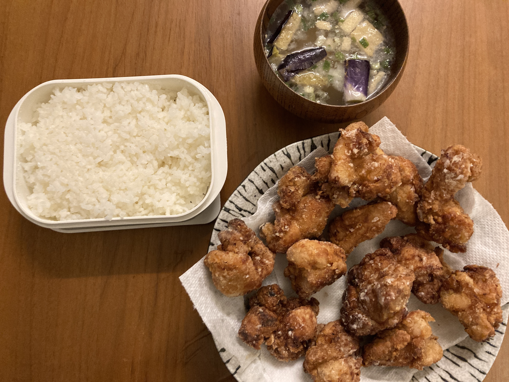

二番目に行きたい会社のかなりハードコアなバーチャルオンサイト面接は一昨日の水曜日に終わって、ほぼ全部終わった感じになった。
その面接は、朝１０時から１時までノンストップでコーディング面接、バックエンドのシステムデザイン面接、エンジニアリングマネージャーとの行動面接、１時から２時はご飯食べて、２時から、フロントエンドのシステムデザイン面接、最後にテクニカルなプレゼンをする的な面接をやって終わり。死ぬほど疲れた。ひどいミスはなかったと思う。３つはかなりいい出来、で他の二つはどうなんだろう？と言う感じの出来。まぁ、受かってたら自信になるな、有名な会社だし。

で、今日は朝からオファーのメッセージもらった会社のCTOが朝ごはん食べようと言ってきたのでマンハッタンで二人でご飯。多分給料のオファーの前のやる気チェック的なものだと思う。もう大体この会社に行こう、と決めているので、かなり前乗りに行きたいと言っておいた。昼前に給料を提示してもらった。

そのあと、もう一つ、どうしてもうちで働いて欲しいみたいに言われている会社のCTOをHead Of Peopleの二人と面接した。もうちょっとタイミングが悪いので断るべきだなぁ。でも暇だから、一応話してみた。急いでオファーしたいと言っていた。うーん。

もうしんどくて緊張するような面接は全部終わって、給料の交渉ちょっとして12月の２週目くらいにはもう働いているのかな。この１ヶ月とちょっと一通りアメリカでのテック企業の面接全部体験できて全体的に上手く行った気がする。正直こんなしんどいとは思っていなかった。

明日、友達がお疲れ！マンハッタンの銭湯一緒に朝からいこう！って言うことになって明日の朝楽しみ。さて夜の１０時前だけど、もう寝よう、疲れた。夕ご飯は鳥の唐揚げ作った。上手くできた。

