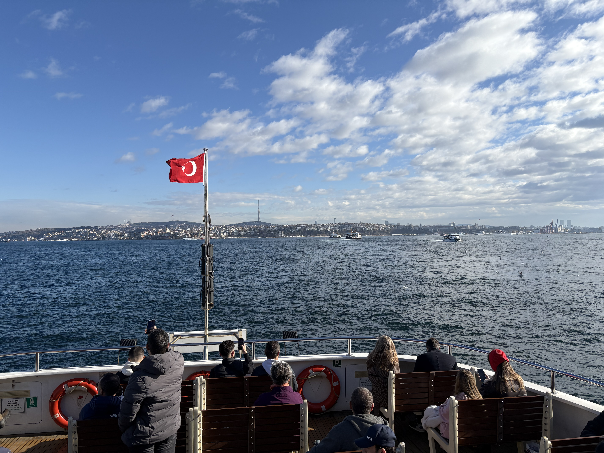
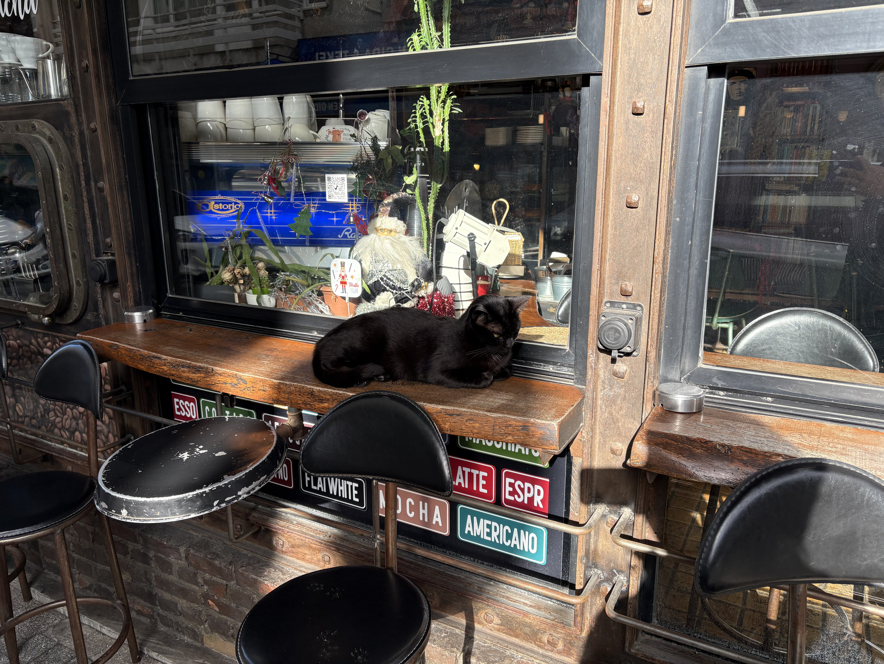
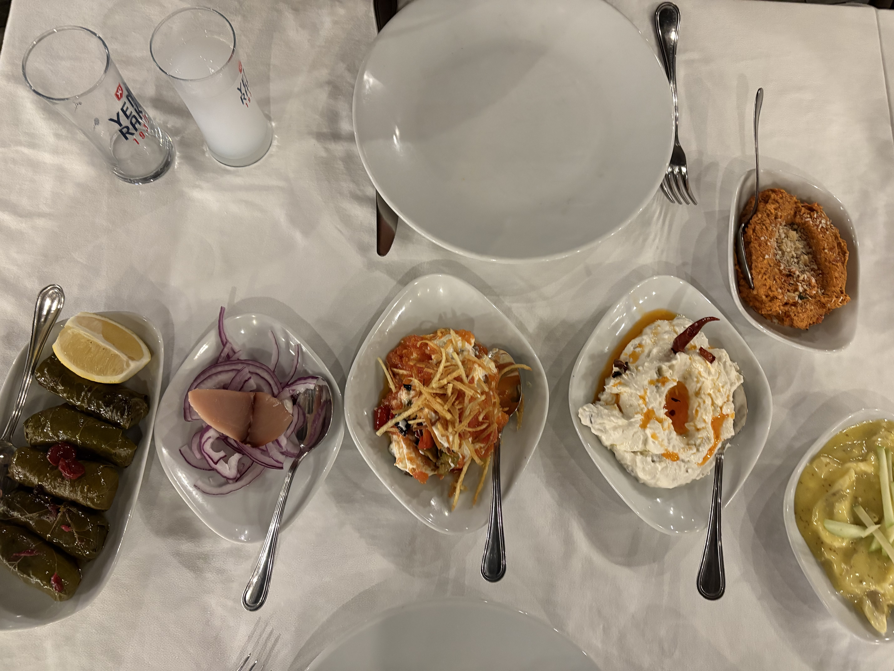

イスタンブール二日目。時差ぼけがきつい。ホテルの朝食普通だな、と感じてたけど、これが伝統的なトルコ朝食らしい。そうおもって食べたら美味しい。

小雨が降っているけど、イスタンブールの小雨もまたいい。歩いてSuleymaniye Mosqueっていうモスクに向かう。モスクはどこでも同じ感じだ。豪華に装飾は施されているけど、祈るためのでっかい一部屋。その後グランドバザールにまた向かったけど、日曜で休みだった。
もうすでに足が痛い。多分靴があっていない。ホテルの近くまで戻ってBitlisliっていう評価高めの肉肉しいランチの店に行った。美味しかった。

夜には前の会社のイスタンブールに住んでいる同僚と会って夕食食べるので、彼の住んでいるカドキョイという地域までフェリーで早めに行くことにした。このフェリーに乗っている30分が最高だった。ボスポラス海峡の会場をたくさんの船が行き交っている。カモメがたくさんフェリーと並走(?)している。天気もとても良かった。

カドキョイを歩き始めて直ぐにこの街は最高だな、と直感した。数日の滞在は旧市街で十分とどの観光案内も行っていて、カドキョイは長い滞在や2回目の滞在にいい、と書いていたけど、絶対来るべきだと思う。とても平和で静かで、ブルックリンみたいでもあり、鎌倉っぽい感じでもある。カドキョイのもう一つの繁華街はもっと若い感じだったけど、最初に迷い込んだ場所は本当に素敵だった。適当に歩き回って海沿いの公園に着いたらみんな思い思い日本を読んだり緩やかな午後の時の流れを楽しんでいる。私も海辺の岩の上に座ってゆっくりしていた。たまに、猫が寄ってきたので、頭を撫でていた。

それからも数時間カドキョイを歩き回って最終的に疲れ果ててSakura Cafeというところでコーヒーを飲んで休んだ。そこでその前の会社の同僚と数年ぶりにリアルワールドで再開した。そこから彼と一緒に歩いていろいろ文化や歴史的なところを教えてもらったりした。彼はユダヤ教徒なのでトルコでは圧倒的なマイノリティだとか。彼がたまに過ごすという市立の図書館に行ったりした後、ローカルのレストランに連れて行ってもらって長いこと過ごした。

とにかくトルコ人はタバコを吸う。男性の喫煙率は100%に近いのではないか。そのレストランでも室内でみんなスパスパ吸っていて日本みたいだな、と思った。アメリカ人のタバコに対するエクストリームなレベルでの嫌悪感の方が異常で、健康に対する考えとか、いろんなことが、アメリカの方が変、だと最近は思う。ヨーロッパやアジアの方が個人個人が自分と折り合いをつけて自己の幸福に正直にやっているように感じる。

ローカルの酒を飲んだ。スターアニスの透明な酒で水と混ぜると白く濁る面白い酒だった。ローカルのとるこりょうりとあうというのでのんでいたけどトルコ料理と合うというので飲んでいたけど、美味しいかは微妙。結構遅くまで飲んで話して楽しかった。

その後フェリーの乗り口まで送ってもらってさよならした。48度のアルコールの酒を飲みすぎたのか、フェリーの上では顔が真っ青になっていた。

そんな感じで二日目は終わり。
