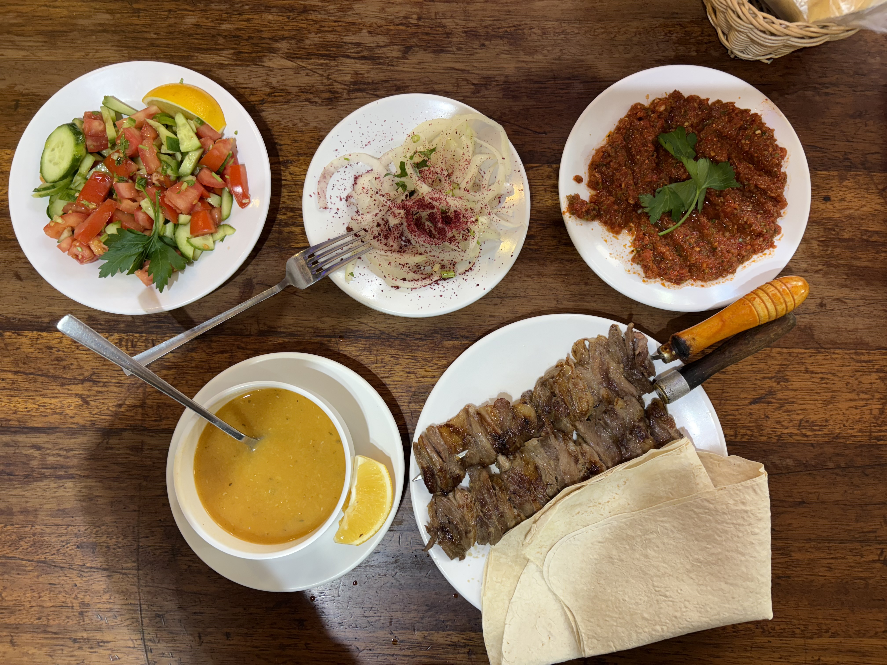
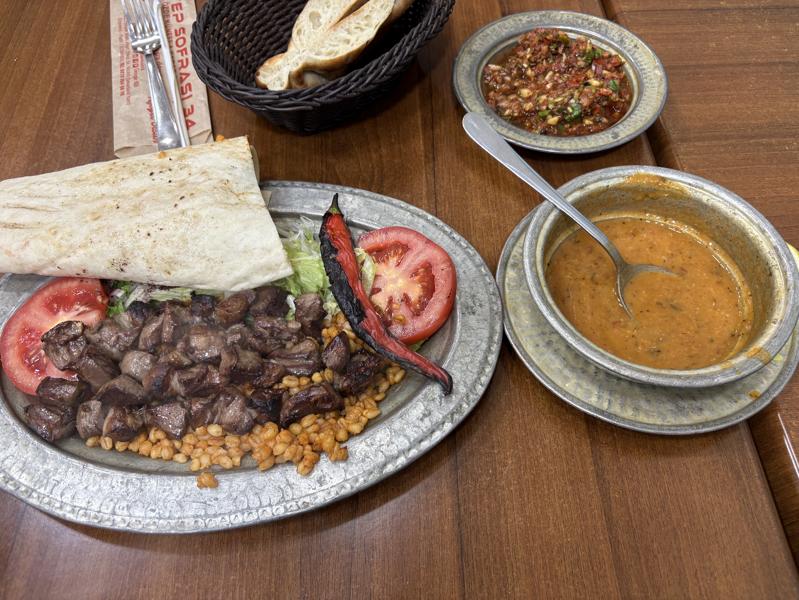

イスタンブール三日目は、もう疲れ切っていた。昨日一緒に飲んだ友達からはフェリーで北の方に行くといいと言われていたけど、大雨の予報も会って、ただ何もせずに過ごすことにした。

ホテルの朝ごはんを食べてグランドバザールに行って、トルコの皿を買おうと思ったけど、欲しいものがなくで何も買わなかった。あるユーチューバーがお勧めしていたレストランで昼ごはんを食べることにした。[Şehzade Cağ Kebap](https://maps.app.goo.gl/g9SUSeHV31BSuN3w5)というケバブレストランで、ここが一番美味しかった。ほんとに美味しくて顔が笑顔になった。その後ホテルに戻って3時間寝た。

それから、夕方の旧市街を散歩して適当な店で羊の心臓のシシケバブを食べてとレンティルスープと、トルコティーを飲んだ。美味しかった。

それでもうホテルにもどった。何もしていない。。ダラダラして10時ごろにドネルケバブ食べた方がいいかと思ってホテル近くの店で食べたら、びっくりするくらい高くて不味かった。地図アプリで見たらポイント高いのにレビューではここは完全な詐欺だから行くな、とみんな書いていた。ミスった。。

ちなみにホテルは四つ星のホテルに三日滞在した。一泊$100ほどでイスタンブールのホテルはほんと安い。でも、天窓しかない部屋で、あんまりだったかも。

その日はそのまま寝た。次の日は午後３時の飛行機だったので、ホテルの朝食を食べて、１０時半ごろにホテルをチェックアウト。そのままローカル線を乗り継いで２時間ちょっとかけて空港まで行った。安く済むけど相変わらず苦労した。飛行機は１０時間のフライト。なんか席が狭くてしんどかった。

まぁ、コンパクトなトルコ旅行は楽しかったな。