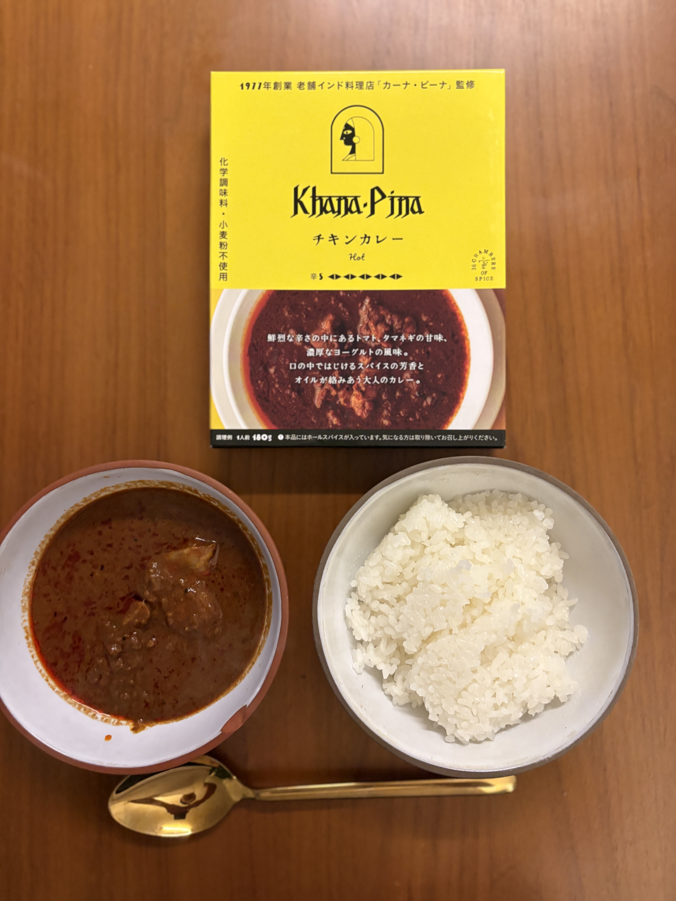

ああ新年からめちゃくちゃ働いている。まぁ最初の半年はがっつり頑張ると決めたので想定通り。でも家では仕事はしないことにして9時に会社に着いて5時に帰るという日々。リモートワークの時みたいにYoutube見たりやたらと休んだりできないので、ずっと働きっぱなしになってる。まぁ、ぎゅっと濃縮して働いているのでいいのかも。
あと、英語はかなり大変。今日も15人くらいの打ち合わせがあったけど全然着いていけずあまりわからなかった。汗。ランチの時間はいっぱい英語が話せて勉強になる。もうオンライン英会話はフェードアウトしようと思う。

そしてこの所のニューヨークはとても寒い。ずっと氷点下。でもこういう寒いニューヨークが好きだ。朝８時過ぎに家を出てEのラインの地下鉄に乗って途中で乗り換えて6のラインでユニオンスクエアまで行くのだけど、あまり混んでないし、気分がいい。

そして、年末年始は風邪をひいた。というか、多分コロナだった。３日程しんどくてその後咳だけがずっと続いている。コロナ特有の完治までずっと時間がかかる感じ。あと、イスタンブールで多分歩きすぎたのか、腰を痛めてそれも大変だった。今でも90％まで回復したけど、完全ではない。

まぁ、仕事は楽しくやっている。個人のプロジェクトをちゃんと頑張ることにしたのでそろそろ活力を上げていこうと思う。

