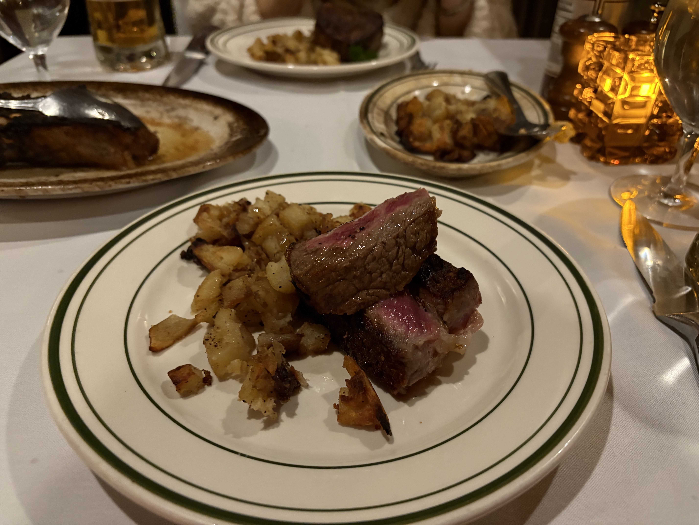

あーがっつり働きまくっている。ニューヨークは毎日寒い。
働いて家帰ってご飯食べて寝ての生活。厳しい英語の環境は非常に大変だけれども、それこそ望んでいたことなので正直とても辛く楽しい。会社のチームは全員かなりのシニアエンジニアで、自分から仕事を作ってコラボレーションして解決して、よくデスクで議論が始まって、それがすぐにプロジェクトになって、全員が異常なまでの生産性で仕事をしていて、自分も数個のプロジェクトのオーナーシップを持っているし、仕事はかなりいい感じにやっている。自分はフレキシブルで意見があることが強みで、最初は難しかったけど、いうべきことはちゃんと言ってやりたいことは積極的に自分で仕事を作り出しているので楽しいと思う。それにしても、スタートアップのアジャイルとかMVPとか生産性追求の究極的な職場ですごいプッシュされている感じがして、人によっては合わないだろうな、と思う。

それにしても未だ会社から帰ってくるとかなり疲れている。英語のコミュニケーションに緊張しているのだろうと思う。あと、通勤は片道大体３０分だけど、ニューヨークの地下鉄はやたら不安定でいつも困らされていて、それも毎日ちょっとしたイライラにもなっている。

ニューヨークはレストランウイークなので、金曜の夜は、ベンジャミンステーキハウスでステーキを食べた。とても美味しかった。レストランウイークというのは、一人$60で夜または昼ご飯をコースで提供するメニューを数百の有名なレストランが参加して毎年２回くらいやっているもので、ちゃんと選べば安く食べられるのでいい。

まあ、アメリカの政治も異常なことになっているけど、転職最初の１ヶ月はかなりいい感じになった。AIとかに不安も強いけど、戦略的に、そして、Optimisticに行くぞ。