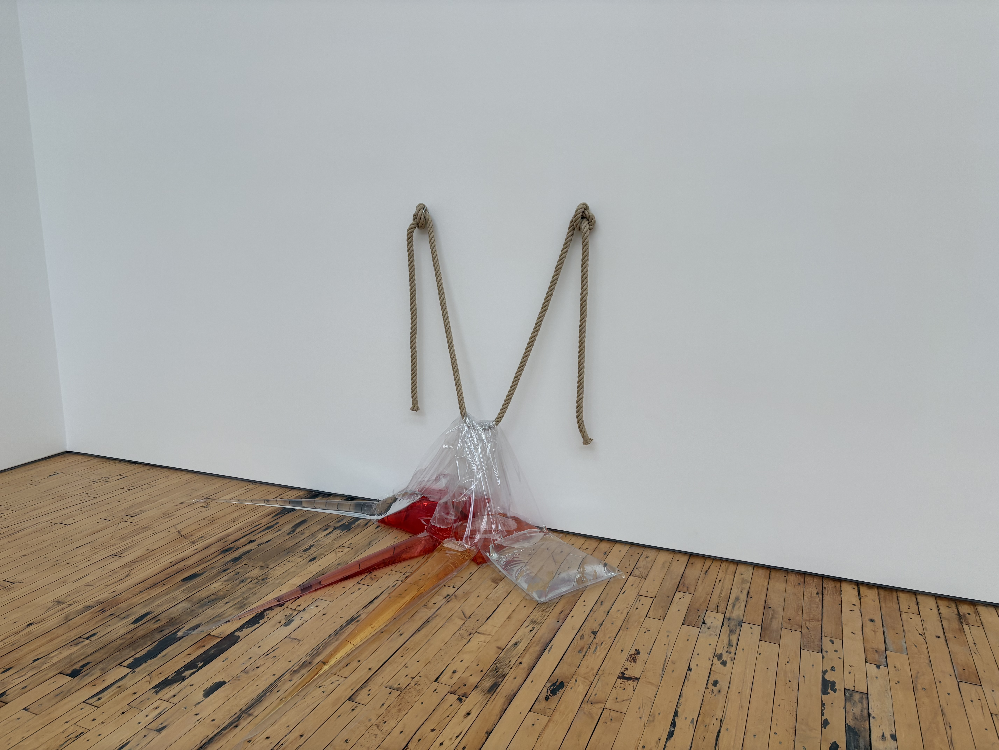

昨日は金曜ということでレストランでご飯を食べたけどとても美味しかったな。会社の近くの[Union Square Cafe](https://maps.app.goo.gl/HimJtBUknY1X187M9)というところで、昔からあるらしい。雰囲気も良くて頼んだご飯全てとても美味しかった。

この２、３週間いつもよりずっと働いて大変だったけど、仕事の結果はかなり上々でみんなから褒められて嬉しかった。いい感じのデザインができたと思う。

そういや先々週は、Dia Beaconにはじめて行ってきた。一人で行ったけどとてもいい時間だった。家からグランドセントラルに出てそこから１時間半くらいの電車をオンラインで予約して電車に揺られてハドソン川を北上、着くと雪が積もっていて雪を踏みしめながら美術館まで歩いた。贅沢なスペースに適度な数のコンテンポラリーアートが置いてあって、最近のアメリカの政治やAIの進化を考えながらいい時間を過ごした。定期的にほとんど作品入れ替わるっぽいのでまた行きたい。

そして今日は久しぶりにほんとに何もしない一日を過ごして疲れが取れた。

英語的にはかなりハードな日々を相変わらず過ごしているけど英語の聞き取りに関してはだいぶ上達してきた。

もうちょっとエネルギー高めでガンガン行きたいな。ジョグングもサボっているし。