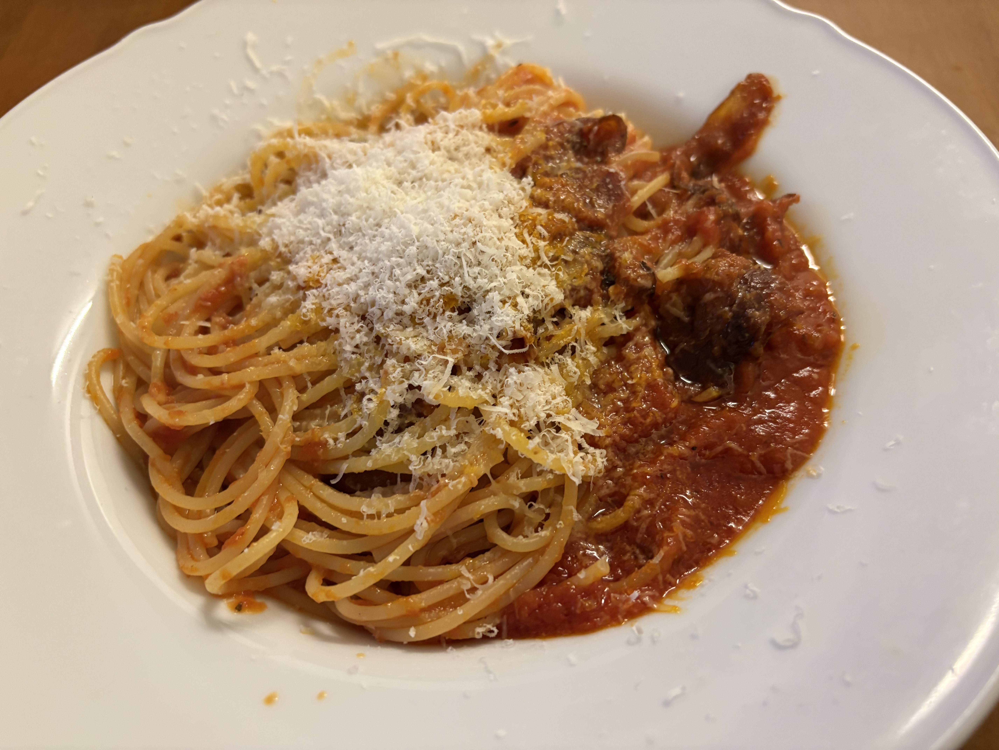

今までニューヨークに住んでいて花粉症に苦しめられたことなどなくて、日本から脱出して良かったことの一つだったのに、今週すごい花粉が飛んでいる。くしゃみ止まらなくて同僚もブレスユーを言うのを諦めていた。帰りにCVSで抗ヒスタミン剤買ったけどちょっと弱かったかも。そして今週は仕事が忙しすぎて今日風邪ひいた。今しんどい、でもなんか変な時間に寝たせいで3amの真夜中にこの日記を書いてる。明日は一日寝るかな。

仕事頑張っているお陰で会社で今日はとても仕事のことを褒められてかなり嬉しかった。今日のレトロミーティングでは同僚に最近の自分の仕事のコードがとても美して素晴らしいと言われてほんと嬉しかったし、マネージャーとの1-1でも仕事のプライオリティの付け方や仕事の進め方、プロダクティビティも素晴らしい。他の同僚の手本になっている、とベタ褒めされた。よし、もっと頑張ろう。

冬も終わってニューヨークも明るい感じになってきそう。

ニューヨークでグアンチャーレを買おうとするとすごい小さいブロックで$40とかするので、買うのを躊躇することが多いんだけど、最近グランドセントラルの地下で質はあまりかもだけど、安く買える場所を見つけて、ちょっとカリカリ気味にしてアラビアータにそれを入れたらとても美味しかった。
