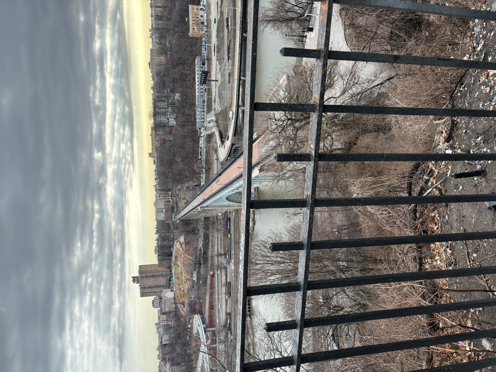

ここのところこんつめて仕事してたら、家に帰っても週末も頭の中で考えてる状態が続いてそれで夜中に起きる感じにもなって睡眠不足が続いて、さらにチームのやり方が実験的ではあるけど一気に今週変わったせいで、体が悲鳴あげて今日はもう疲れ切って早退した。この週末は仕事しない。ちょっとやりすぎた。スマートに仕事時間の８時間の集中だけにする。ちょっとやり方変えないと続かない。こう言うバランス取るのいつも下手なのでちゃんとやらないと、と思いながらずっとできた試しがないし、まず運動だな。週末はちゃんと休むぞ。

先週末は友達とセントラルパークからブロンクスまで２０キロ以上歩いて楽しかった。
