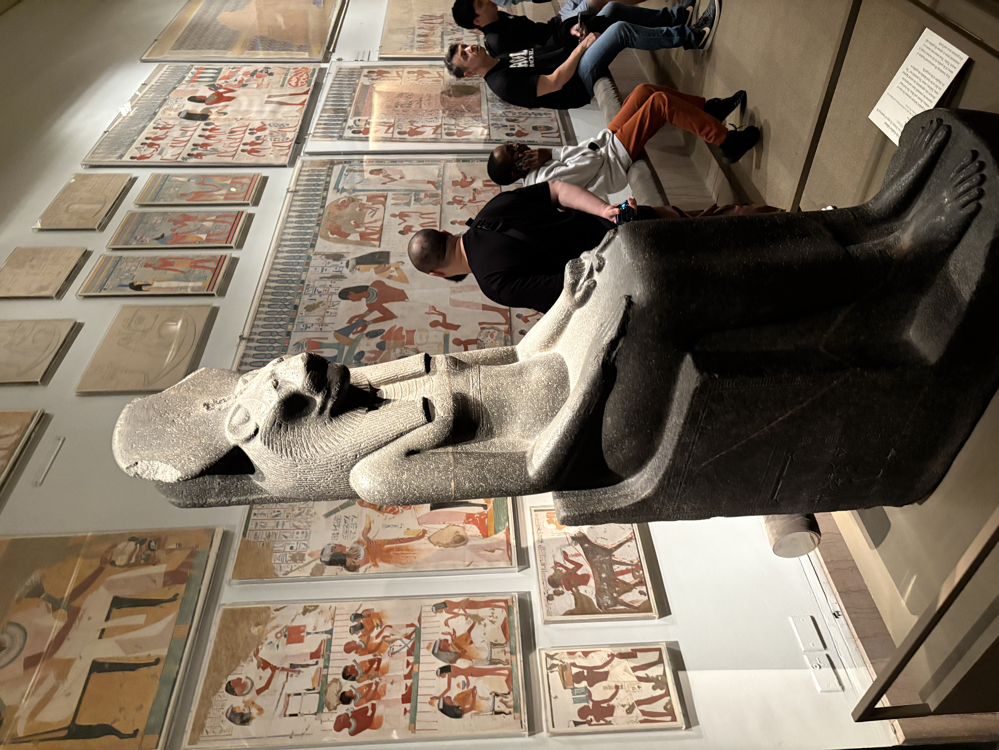

体が疲れている。

アメリカで本気のオフィスライフを経験している。チームで問題があって真剣に話し合ったり、うまくいかなくて討論したり、いろんなことが起きて、やたらとミーティングあって、本当に最上級の英語勉強体験っという感じ。今週は疲れすぎて、この週末は脳が仕事に関するものを受け付けない感じ。今日は土曜日、外はずっと雨。桜が満開らしいけど、雨で行けなかった。ずっと頭の隅にあってprocrastinateし続けていた税申告を午前中に済ませた。妻が昨日の夜に日本に行ったので今日から一人。これはこれでいいタイミングというか、３ヶ月がっつり新しい会社で働いてちょっと疲れて、一人満喫できるのはいいかも。

昼寝したり、アラビアータを作ったり、羊羹を見つけて食べたり、最近ハマっているチャイをお風呂の後に作った。グリーンカルダモンとクローブと生姜と紅茶と牛乳と砂糖を淹れて煮込んで簡単でとても美味しい。

最近仕事が大変で、全然笑えてないなと思って、ずっと停止していた英語のレッスンを今日は２時間入れてずっと一緒にやってる英語の先生と久しぶりに笑って話せてよかった。週に３回は英語のレッスンをいれていこう。

アメリカの政治を無茶苦茶で滅入ることしかないから、ちょっと無視している。明日は外に行くか、家で個人プロジェクトでもやってゆっくりして、一人で昼間からちょっとワインでも飲むかな。

最近、なんか落ち着かないと、METのエジプトのエリアに行って太古の昔に想いを馳せる癖がある。
