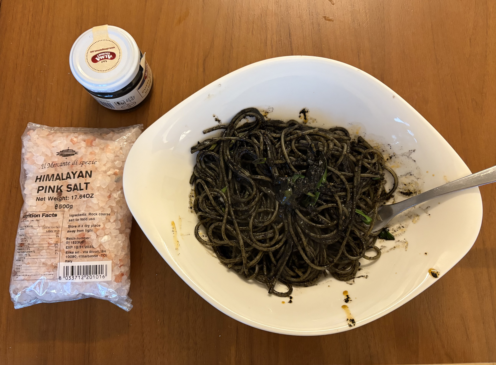

毎日色々考えたり悩んだり。仕事ってなんだろうとか。無限に続く仕事とどう折り合いつけていくか。訳のわからない忙しさのせいで無駄なことを考えてしまっている気もする。

英語の能力が低いせいで、英語を話したり聞いたりしている間の脳の使用率が100%になっていて、ネイティブに獲得した言語だと3-5%くらいでやれるようなものなのに(例えば仕事しながら周りで起きてる会話完全に理解してるし)、それが本当に帰る時には体が疲れ切っている。それに加えて、人間関係的な悩みというか、自分は元々よく話す人間なのだけど、全然話せないし話すことに臆病になってるし、本当大変。まぁまだ３ヶ月だ。３ヶ月でここまで上達すれば上出来だろう。今までのニューヨークに住みながらの5年のリモートワークはなんだったのだろうか、と思うくらいだ。

まぁ、深く考えないで個人のプロジェクトとかも楽しみながら、健康に美味しいものを食べて日々を進めていくだけでよしとするか、という感じにいつも落ち着くのだけど。今までの５年の平穏さと比べると格段に浮き沈みがあっていいのかも。

でももっと仕事も淡々とやるべきだな。

今日は帰りに24thのオフィスを出てから32ndあたりにあるイータリーまで歩いて、イータリーでイカ墨と美味しそうなパスタとヒマラヤの塩を買ってそこからLラインに乗って帰ってきた。

帰ってきてYoutubeでレシピ確認しながら、イタリアンパセリがなかったのでネギで代用したイカ墨パスタを作ったらすごい美味しいのができて満足だった。その後風呂に入って、コーヒーを入れてパソコンに向かって日記を書いている午後10時。

