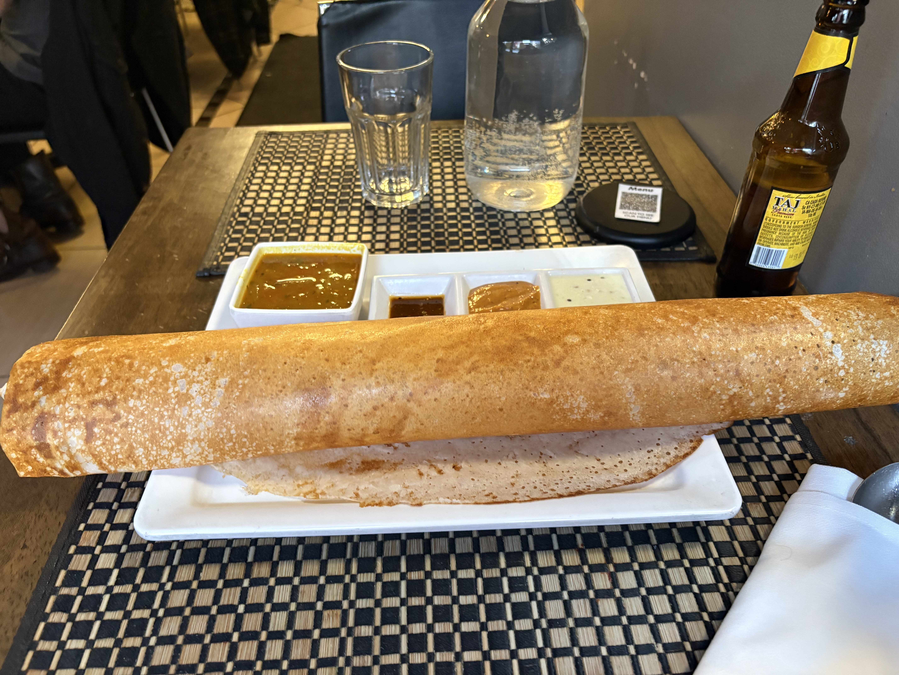

今週は仕事は平和だった。エンジニアリングマネージャーにこの３ヶ月での英語の進化をすごい褒められて嬉しかった。自分の英語はFiller(you know的な)も全くないし、いつも非常に整理されて論理的な英語を使うから、じつはほかの同僚の英語よりいい、と言われた。日々勉強、そして仕事とは別の自分個人の時間を毎日過ごすためのメンタリティ的なものがうまく構築されつつある気がする。個人プロジェクトをちゃんとやる。

そして来週働けばパリに出張だ。３日だけ仕事してその後四日ほどゆっくり滞在する。前の会社の同僚に会ったり仲良くなった英語の先生にあったりする。去年もパリに行ったけどルーブル美術館行かなかったのでゆっくり楽しもう。

アメリカに住んで５年半3Dプリンター以外に自分自身に投資していなかったのと、ストレスも最近高かったので、ちょっといいものを買おうということで、[JBL L82](https://www.jbl.com/bookshelf/L82+CLASSIC+LOUDSPEAKER.html)というスピーカーを妻に相談もなしに勝手に買った。アンプも持っていなかったので、Sonos ampも買って、今週の木曜からいい音を満喫していて幸せ。

今日は以上に気温が高くて、外に出てロングアイランドシティのイーストリバー沿いを歩こうと、BOBAティーを買って、散歩をしていた。ふと、８年ほど前に大学の友達の結婚式に参加した時にその友達の一人で大学時代ずっと仲が良かったのにあることがきっかけで死ぬほど嫌われた元友人にあった時のことを今日思い出していた。

彼は家庭を持って大学の教員をやっているらしいのだけど、結婚式の後に行ったレストランで普通にみんなと会話していたら、「まだそんな感じでやってるの？うぜえな。みんなそんな時期はとっくに終わらせて人のために生きているんだよ。お前みたいに自分のために生きてないんだよ。見てるとうぜえわ。」といきなり言ってきた。その言葉をなぜか思い出していた。

この歳になって思うのは、自分の精神年齢はずっと２０代から変わっていないし、自分のことばかり考えているな、ということ。周りに合わせることも覚えたし、うまくやることも最近は覚えたし、人の話も遮らないし、自分の本当の考えをあまり人に話すことも無くなったし、ずっとあらゆることをメタ的に考えて、あらゆる喜怒哀楽をある種他人のことのようにとらえて最近は生きている。

それでも根本的に幼い自分の精神はほぼ変わらないし、よく人が挫折とか、諦めるとか、色々言って都合をつけているのとか、全くわからないし、人と自分を比べることも自分はないし、好奇心と、あとは、辛いことから逃げたいと言った本能的に部分のみで生きているだけなんだけど、いいのか、ダメなのかさえわからない。自分に対する理解はここ５年でだいぶ深まった。でもよくわからない。生きる理由もよくわからない。それでも生きる活力は常に高いし、楽しく、起きている間は常に物事を深く考えているし、まぁ、いいかな。死ぬまで生きるだけ。他人に迷惑をかけながら。

こういうことって全く考えなくなるし、自分はオンラインのソーシャルな活動もしないので、他人が何をやっているか知らない。日本で仲のよかった人たちが何をしているのかも全く知らない。そして、アメリカに来るにあたって日本での死ぬほど苦しい人生から断絶する必要があった。なかったのかもしれないけど、あったと思う。人生をリセットしたいわけではないのに、結果的にそう言った感じになってしまった。なってしまったからしようがない。日本を出る直前の10年間は地獄だった。悪魔に呪われていた気がする。だからそうしたのだけど、後悔すべきなのかもしれないけど、あまりそう言ったことができない。人としての心がないのかな。何かが自分に足りない気もする。でも何かを変えることでもない。

今までに生きてきた歴史と経験とそれのサイドエフェクトとしての思考そのフィードバックがその人を規定するのだから、そのフィードバックに関しては常に意識的にやっていこうとはしている。とにかく自分がおっさんすぎることが最近は不快。でもアメリカは誰も年齢を気にせず生きているから楽。会社の同僚も自分よりずっと若いのに同じ感じで接してくれるので本当にいい。あと、アメリカは個人主義の国なので、自分のことを考えてばかりの（メタ的な意味も含む、そこまで自分自分しているわけではない）自分によくフィットしている。

最近お気に入りのインド料理屋に一人でよくいく。[Anjappar Indian Cuisine](https://maps.app.goo.gl/nTRWrkxob8wtP3T39)という店。

