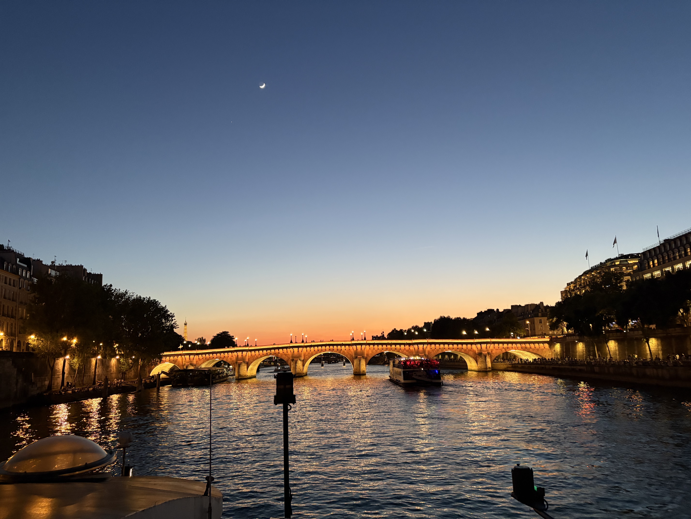
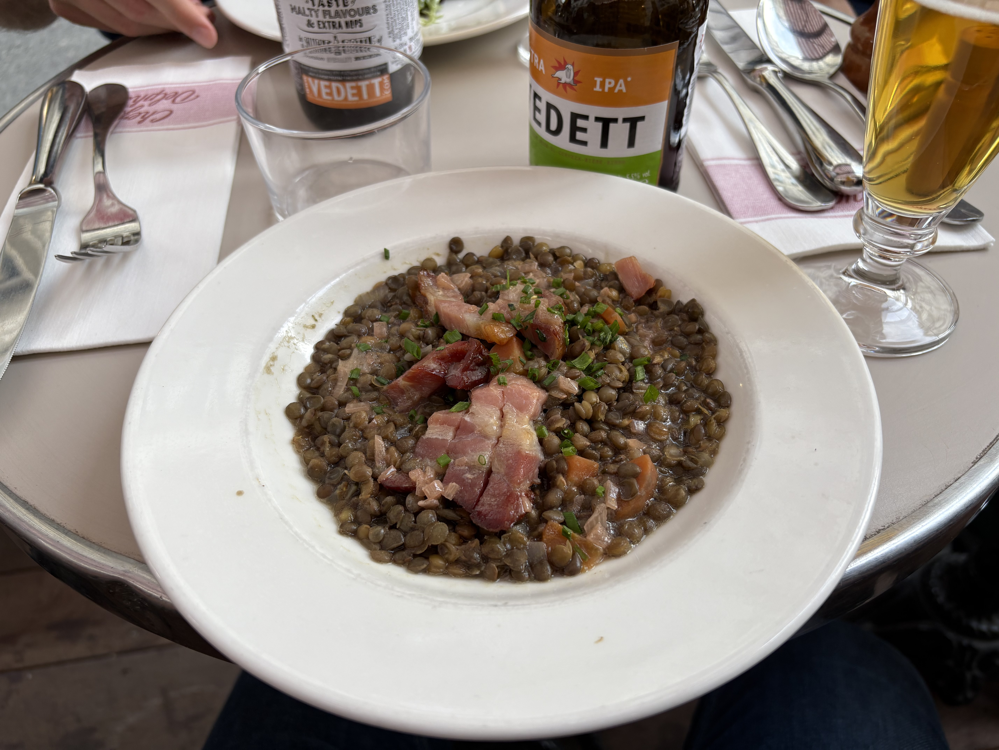
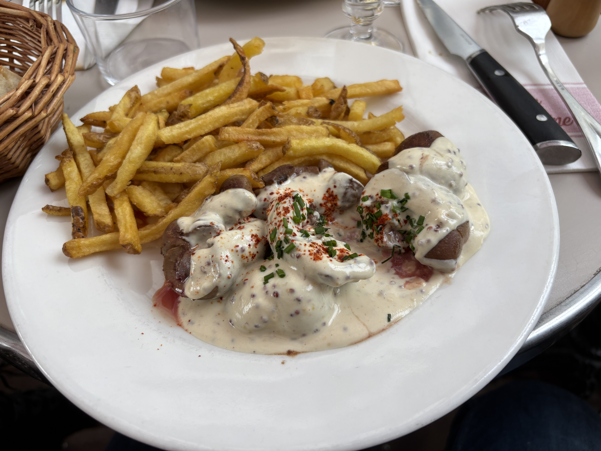
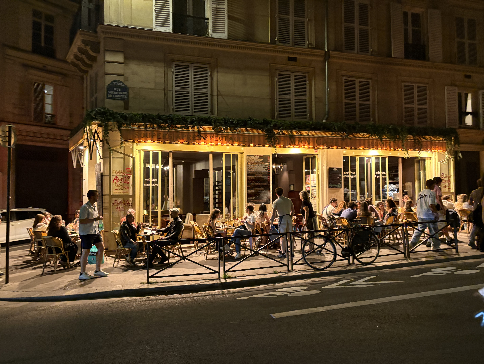

パリに会社の社員旅行で行ってきた。３日間は会社の人たちと、そのあと３泊一人でゆっくりしていた。会社の人たちとだいぶ仲良くなった気がした。でもみんな若すぎるというか、真夜中までずっと飲んで遊んで朝からグロッキーなままイベントこなしたりしていてついていけないのでバーに行くのを横目にこっそりホテルに帰った。そういうタイプの人たちもたくさんいたけど。あとは、会社のエンジニアリングマネージャーの一人から、ソフトウェアエンジニアとしてめちゃ優秀だと言ってもらえて嬉しかった。

あとはパリに住んでいる前のフルリモートの会社の仲間とみんなでディナーを食べてワインを遅くまで飲んで楽しかった。仲のいい英語の先生ともあって日本食食べたし。一人の三日間は特にすることなく、美術館のチケットもオーバーツーリズム的なもののせいで一切取れなかったので、ひたすらパリの街を歩いていた。

まぁ、そんなこんなでやっぱり飛行機は大嫌いで全然眠れないし時差ぼけにも弱いしで旅行は億劫だといつも感じる。今回はよく本(SF)を読んだ。世界中に知り合いがいるのはいいことだ。一緒に飲んだ一人はアーティストになったのだけど、今売れてきていてアトリエにも行ったけど素晴らしいアートだった。かっこいい。みんなで飲んだ時はみんな人生に対して真剣で、自分はそこまで深く考えずに生きているなぁ、と感じた。
