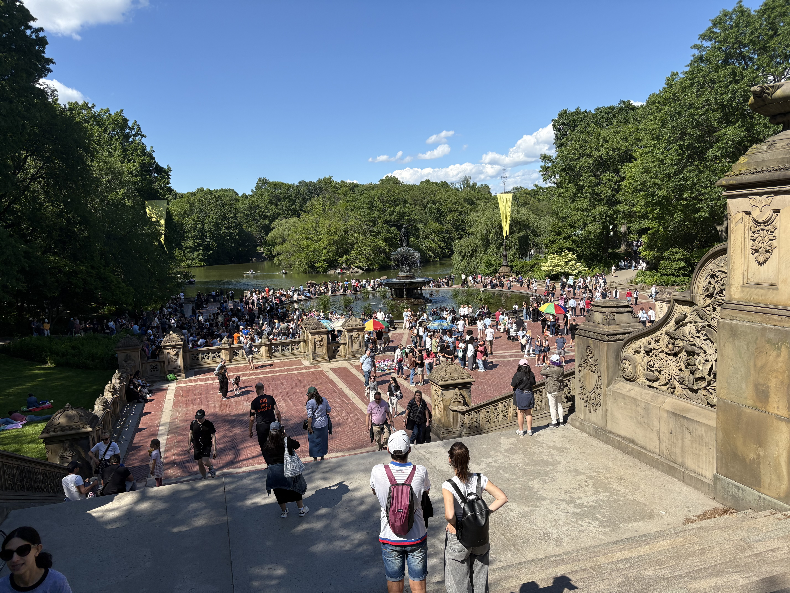

この週末はアメリカはメモリアルデイのおかげで３連休だった。
なんか色々しようかと思ったけど、ほぼ何もしなかった。今日は釣りに行く予定がめんどくさくてやめてしまった。代わりにセントラルパークに行ってずっと歩いていた。この春から夏に変わる季節は緑が爆発していてとても気持ちがいい。

前回の日記に書いた、あと5年で世界の仕組みがガラッと変わるということが頭から離れない。全員がベーシックインカムを得てクリエイティブで楽しいことのみを追求するほぼユートピアとも言える社会、というのがとても想像しにくい。それでも競争と比較からは離れられないだろうとは思う。よりローレベルなものへの価値が上がるのか？経験とか、性格とか、人としてのユニークさをはなる指標的なものへの重要性が上がる気もする。例えば、得られない経験をバーチャルに(バーチャルという言葉も死後になっていそうだけど)得られる、みたいなものへの探究みたいな世界か？自分の性格をプロテクトするための何かがあるのか？複数のアイデンティティが融合する的なこともあるのか？色々思考は尽きない。さて今何をするか。

まぁ悲観せずあと10年は頑張らないといけないと思っておくべき。明日から仕事頑張ってジョギング再開して食制限も続けよう。

