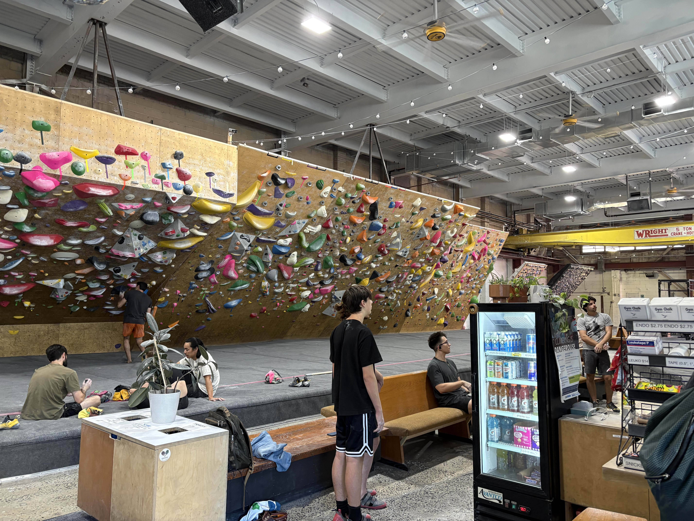
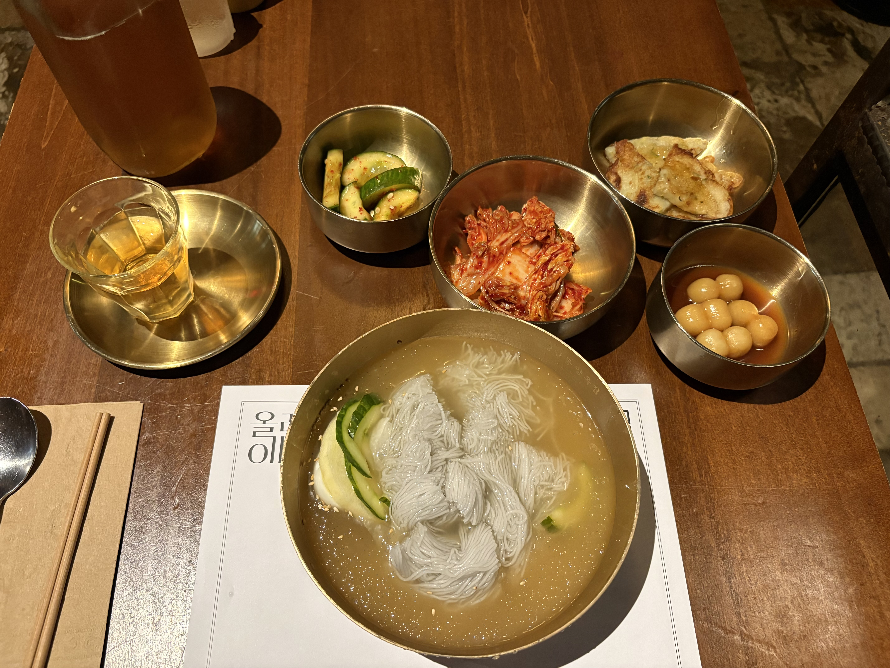

ほんとずっと日記書いていなかった。会社の仕事はとても上手くやってる。優秀なエンジニアとして認知されて非常に難しい仕事を任されている。と同時にアメリカのテック企業特有の容赦のない文化の問題にも少し悩まされている。あまり気にしてはいないけど弱肉強食感が強いしローパフォーマーは切られるし大変な場所だと思う。それでも英語はだいぶ上達したし仕事はやりがいあるし当分続けるつもり。

２ヶ月前に友達に誘われてボルダリングを始めた。週に一回しかやっていないけど楽しい。ジムがLower East Sideにあってちょっと遠いので、そこは解約してもっと頻繁に仕事終わりに行けるクイーンズのジムに移動するつもり。

いまだにジョギングを再開していない。体力がない事を痛感している。週末ずっとダラダラしてしまう。ジョギング再開しないと。いいメディテーションなのに。

妻は最近ピッくるボールにハマって毎日のように練習に行っている。健康にアメリカライフを楽しんでいるようで嬉しい。

あと、仕事は頑張るにしてもやっぱり仕事だけをしているのは非常に虚しさを伴うので、サイドプロジェクトを本当に真剣に取り組むことにした。相乗効果で仕事や生活にももっとハリが出ると思う。

サイドプロジェクトはずっとやりたかった電気工学の独学と何かのプロダクトを作ること。ソフトウェアエンジニアリングと3DプリンティングとElectronicsの三つでなんでも作れるようになりたい。Maker Faireにも参加したいし、Redditとかで色々コミュニティーにも入りたい。

とにかくこのところ仕事で疲れてそろそろ休みが必要。九月後半は日本に旅行するけど田舎とか知らない土地に行ったりしたい。日本のことも知らなさすぎる。

暑い夏も終わってニューヨークはもう秋の様相を呈している。毎日だいぶ早めに駅を降りてたくさん歩いて会社に行ってるけど秋を感じて気分がいい。。

