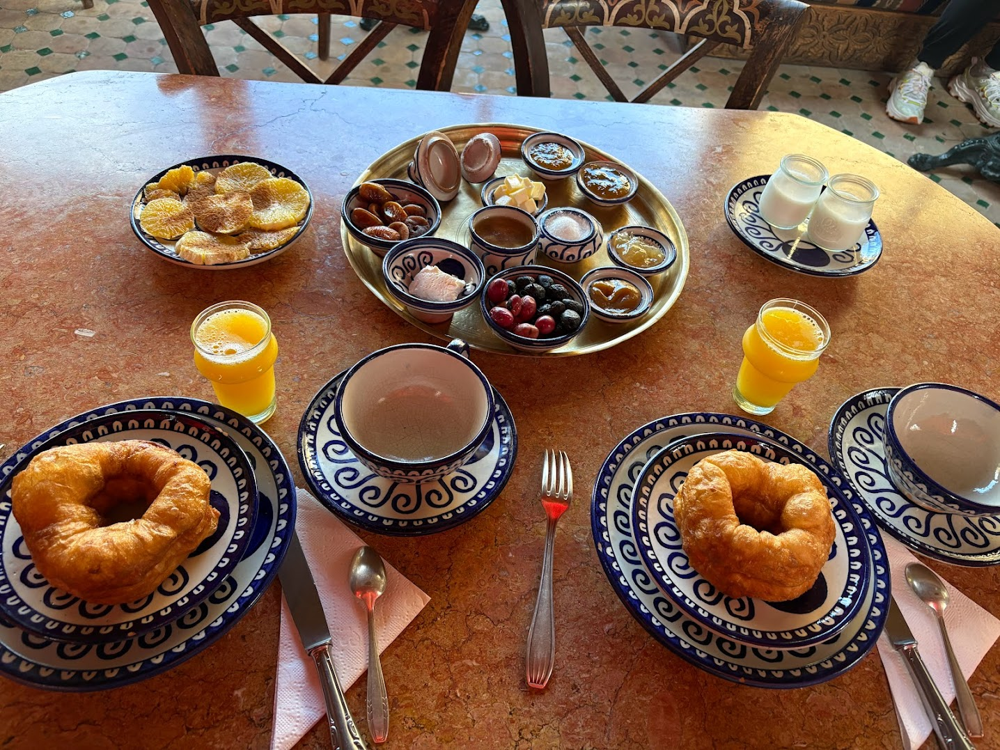

新年が明けた。
結局全然日記を更新していないな。

十二月は八日から休みを２週間取ってモロッコに遊びに行った。初めてのアフリカの国訪問。まだ開発途上の国でヨーロッパに植民地化されていたからヨーロッパの影響を受けている日本人から見てもまたちょっと違う角度でエキゾチックな国。料理はバラエティが少ないので途中で飽きたけど美味しい。思ったより寒くて砂漠では大雨とヒーターのない宿で風邪をひいた。１時間だけラクダに乗って人生初めての砂漠大変はできた。まぁ、ゆっくりできたけど、途中で引いた風邪がコロナだったのか、帰ってきても３週間ほど治らなかった。

帰ってきてからはWFH(家から働く)を年始まで取っていたのでオフィスには行かずダラダラ働いて、なんか十二月はほんとにダラダラしていた。

と言うか、2025年は仕事環境の大変さを理由にしてすごいダラダラしていた気がする。英語は格段に良くなったけどいまだに苦労している。今の会社で働いている一番大きな理由はいまだに英語だ。あと英語のせいでやっぱり新しい仕事を探すのが怖いのもある。

今年は、ずっとアクティブに行こう。個人プロジェクトを十二月からちゃんとやり始めた。コードを書くプロジェクトに加えて小金を稼げるプロジェクトもやっていこう。
運動はサボりすぎて全然やってない。次の血液検査が怖い。毎日走ろう。自分にとってジョギングすることは人生をアクティブに保つ最良のやり方なのだから。そして電子工学を独学しようと言う目論見も延期に延期を続けているので、それもやりたい。

ことしは個人プロジェクトをたくさんやる、と言うシンプルな年始目標。