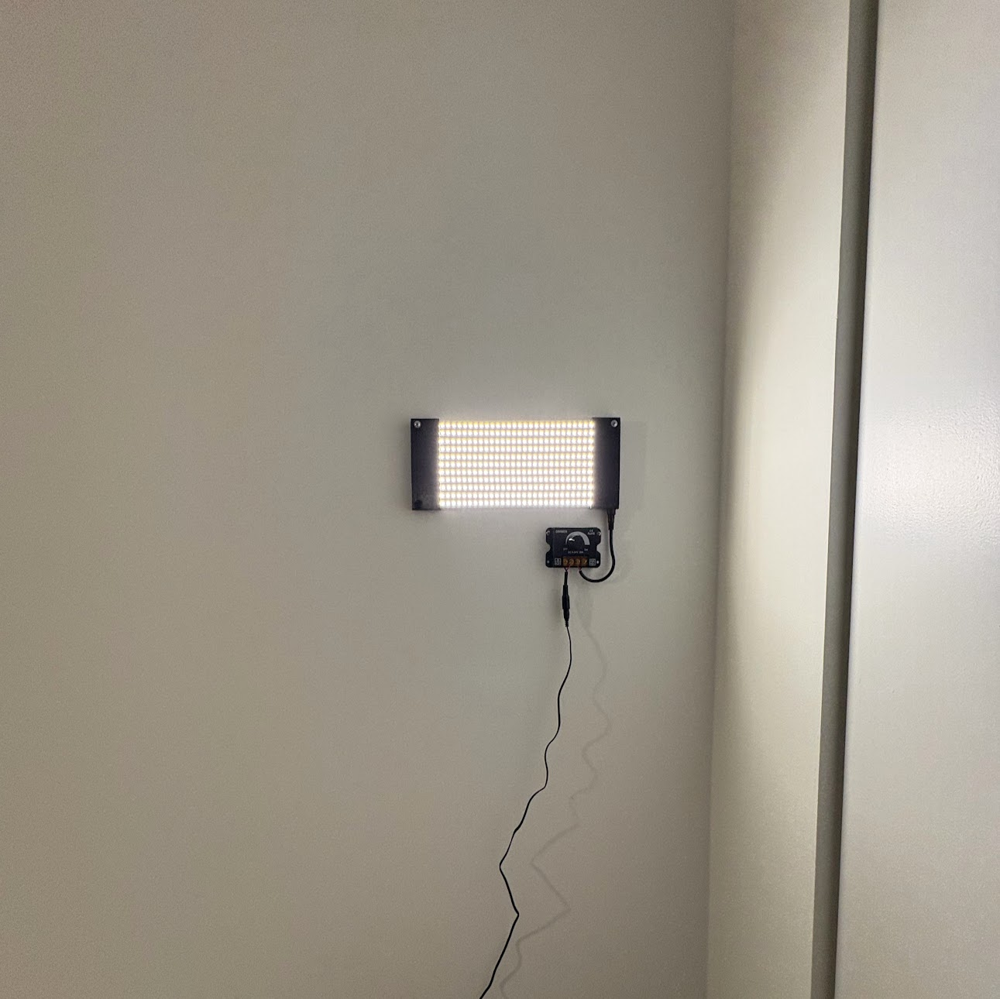
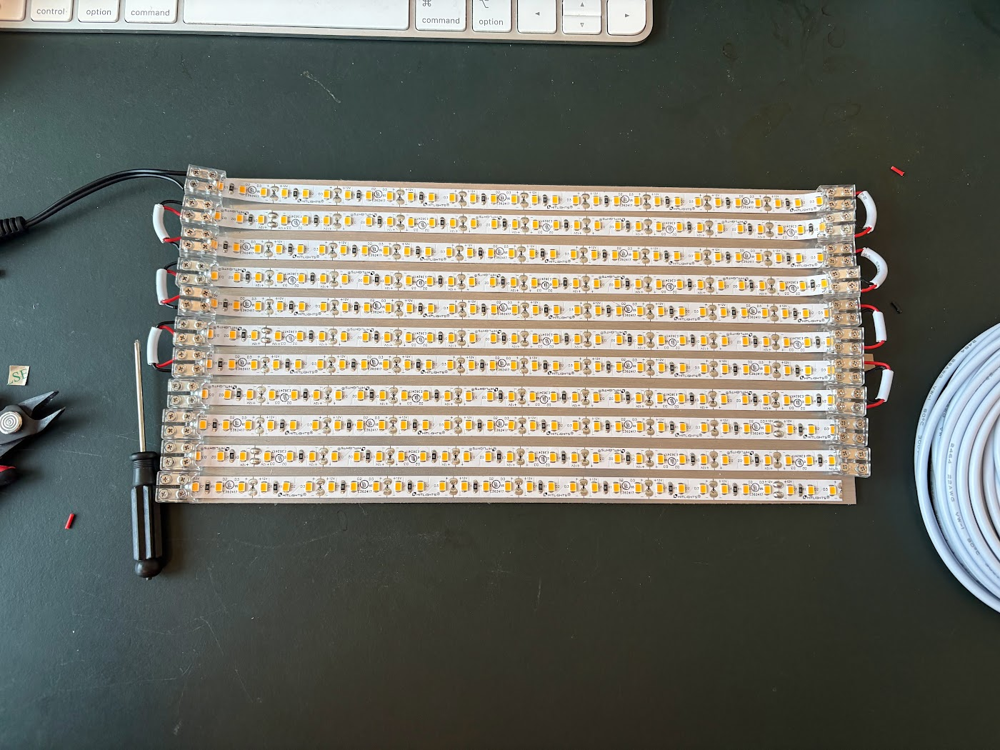

前回の日記で、英語、電子工作、その他の個人プロジェクト、運動をちゃんとスタートする、と決めてから、結構ちゃんとやってる。運動はまだちゃんとやっていない。それでもよく歩いて週末は友達とボルダリングをしにジムに行ってる。

あと健康診断位久しぶりに行ってきた。高すぎた血圧は薬のおかげで正常に下がっていた、よかった。Hピロリの検査も去年から勧められていたから300ドルしたけど呼気検査を受けた、これも陰性だった。コレステロールが高くて、相変わらず糖尿予備軍に引っかかっていた。明日リモートで色々ドクターに言われるみたい。

英語に関しては、英語で本をちゃんと読み始めた。最近はずっと日本語でSF小説ばっかり読んでるんだけど、プロジェクトヘイルメアリーを読んでなかったので、英語で読み始めた。普通の楽しく読めることに気づいたし勉強になる。英語のインタビューをたくさん聞き始めている。シャドーイングもちゃんとやれ、と英語の先生に言われてるのでやらないと。

電子工作は照明のinitialバージョンができた。こんな簡単なものでもAIにたくさん聞いて勉強できた。次のバージョン用にESP32を買った。あと、フルカラーの一つ一つ制御できるLEDストリップも買った。でも次はボタンで明るさを調整できるようにしたい。

仕事はやっぱり英語に足を引っ張られている気がする。まぁ毎日に詰め込みすぎないように楽しんでやっていこう。

アメリカの政治は無茶苦茶、AIの進化は異常な速度で、多分今年の終わりにはクリティカルな部分の実装は人間がやることは許されない世界になっていそう。AIのコードの方が完全に質が上回って、人間はハイレベルな(AIがさらに効率的にコードが書けるような)設計作業が主になっていそう。最近はAIの生成するコードやコードレビューの質に圧倒される。極めて有用。明らかに自分の実装するコードもAIの手助けのおかげで品質がかなり上がっている。将来の全てが不安だが楽しんでいこう。

もうちょっと日々考えてることをちゃんと書きたいけど、表面的に終わってしまう最近の日記。