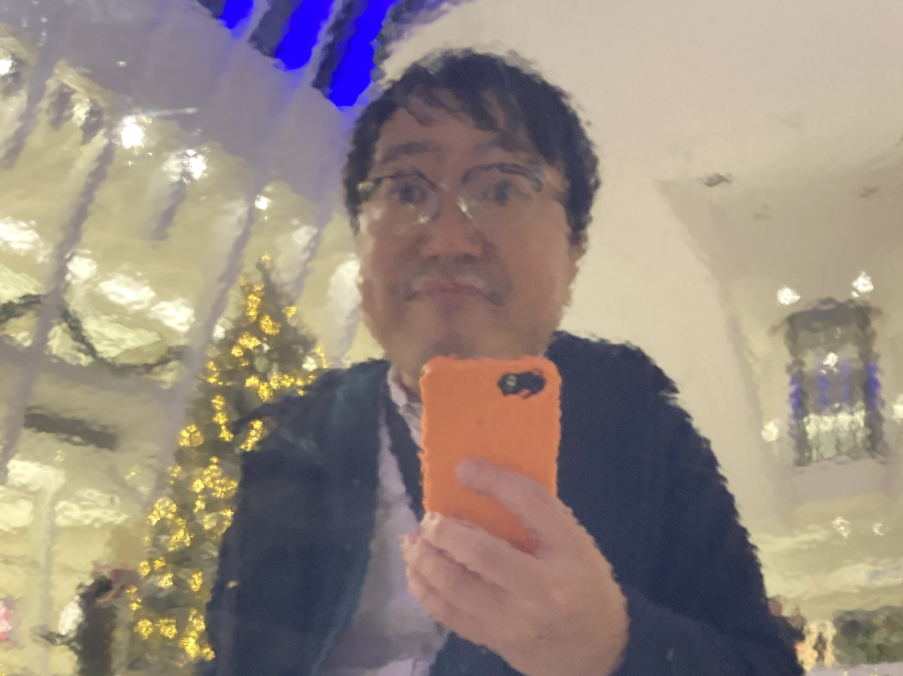

こんにちは、柴田祐介と申します。現在アメリカでソフトウェアエンジニアとして働いています。日本出身で約40年間日本に住んでいました。その後、アメリカのニューヨーク市へ移住することを決めました。今5年ほどアメリカ人住んでいます。

### 経歴

#### Fable

チーフアーキテクト、プリンシパルソフトウェアエンジニア
2019年 - 2024年 / ニューヨーク市, NY

- Fableは、動画やグラフィック、アプリ内（Lottie対応）アニメーションを作成するためのブラウザベースのモーションデザインツールです。Fableには35人の従業員、20人のエンジニア、そして60,000人以上のユーザーがいました。（情報元：Crunchbase）
- チーフアーキテクトとして、フロントエンド、バックエンド、WebAssembly、タスク処理インフラ、OpenGLベースのレンダラーなど主要なシステムを設計・実装。
- 再利用可能で複雑な視覚効果機能を構築できる柔軟で拡張性のある製品構造とファイルフォーマットを設計。
- Rustベースのレンダリングエンジンを主導し、レンダリングパイプライン、シェーダーシステム、WebAssembly統合を実現。
- 10,000インスタンスの同時処理を高可用性でサポートするアニメーションフレーム生成やサムネイル・プレビュー生成用のGPUタスク処理サーバー構造を設計・実装。
- Stable DiffusionとPythonを活用したAI視覚効果機能を開発。
- Stripeを利用したサブスクリプション・決済システムの実装プロジェクトを主導。

#### Gakko

エンジニアリングリード、ソフトウェアエンジニア
2017年 - 2019年 / 東京, 日本

- Gakkoは、子供向けのアニメーション付きストーリーブックを制作・販売するためのプラットフォームです。
- Node.jsを使用したREST APIサーバーと、Github CI + AWSを使用したデプロイメントシステムを設計・実装。
- ReactおよびReact-Nativeを使用して複数プラットフォーム対応のフロントエンドUIアプリを設計・実装。
- WebおよびiOS（Objective C）向けにReact-fiberを使用したキャンバスレンダラーを設計・実装。
- デジタルチームを主導し、実装した製品が投資家の注目を集め、エンジニアリングチームは次の会社Fableへスピンアウト。

#### Semi-transparent Design

エンジニアリングリード、ソフトウェアエンジニア
2003年 - 2017年 / 東京, 日本

- CやC++を使用して、アートインスタレーションを支援するインタラクティブなコードを多数実装。
- JAXA宇宙センターウェブサイト：JAXAの科学者が執筆した膨大なドキュメントを整理するプロジェクトを主導。WIKI構造に基づいた整理システムと管理ウェブアプリを実装。
- レオ・レオーニのインタラクティブ展示：「スイミー」にインスパイアされたOpenGL、Mac OSアプリ、Webカメラを使用したインタラクティブな空間インスタレーションを企画、管理、構築。

#### IMG SRC

ソフトウェアエンジニア
1999年 - 2003年 / 東京, 日本

#### Creo

ソフトウェアエンジニア
1998年 - 1999年 / 東京, 日本

- Solaris Unix上でCを使用してXMLパーサーを実装するプロジェクトに参加。
- テレビデジタル化の政府主導プロジェクトに参加。サブプロジェクトでは、東京タワーの施設での電波送信システムをオーケストレーションするサービスを構築（UNIX, C, C++）。
- UNIXとC, C++でKDDI向けの高性能チャットサーバーを5人のエンジニアチームで構築。

### 学歴

東京大学 応用物理学科
