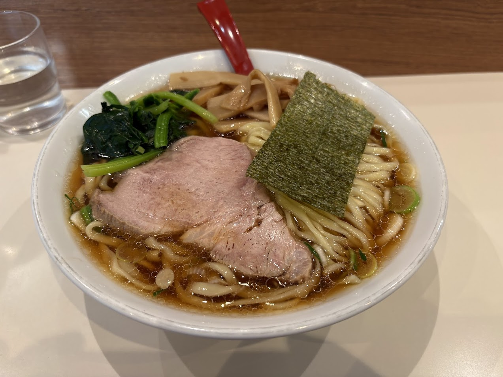
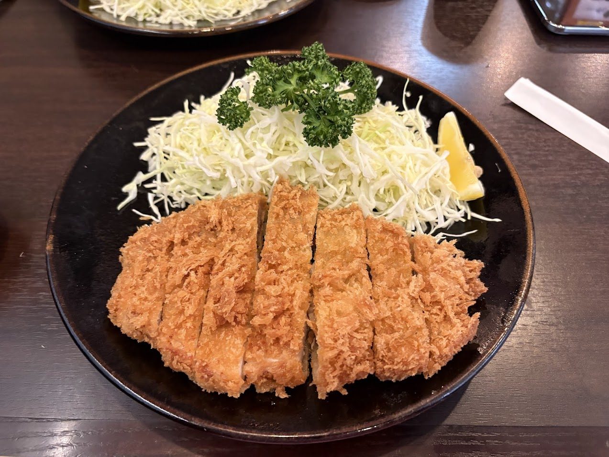
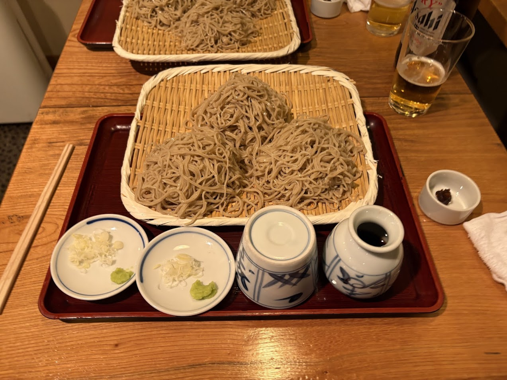
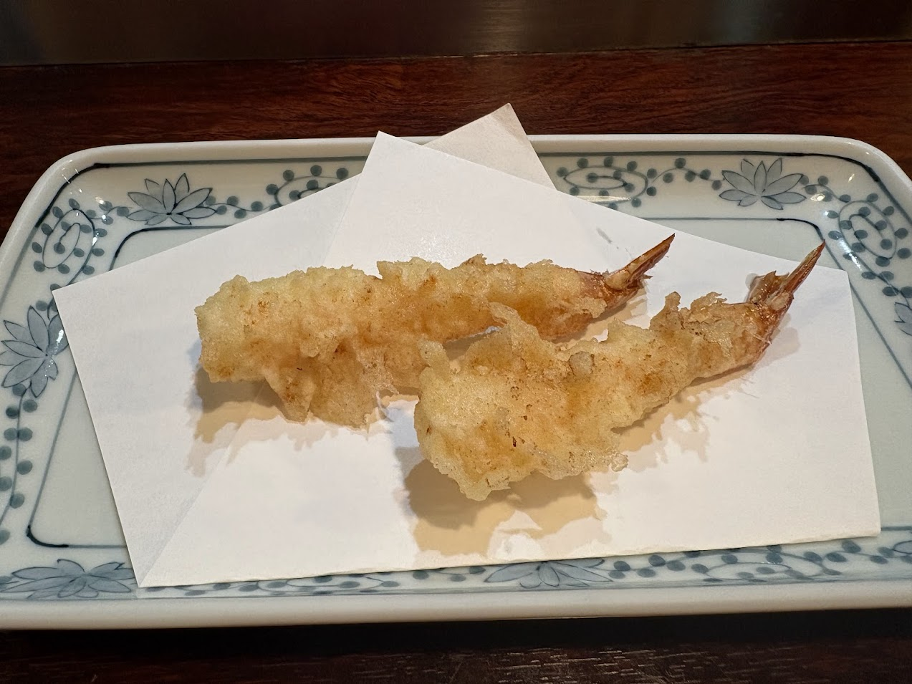
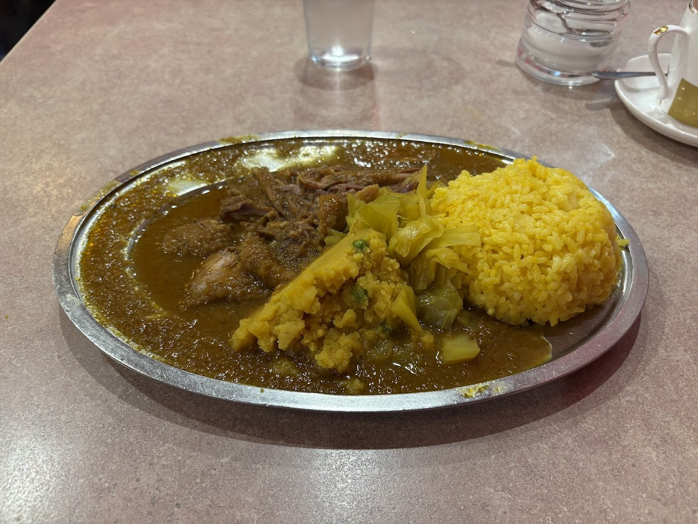
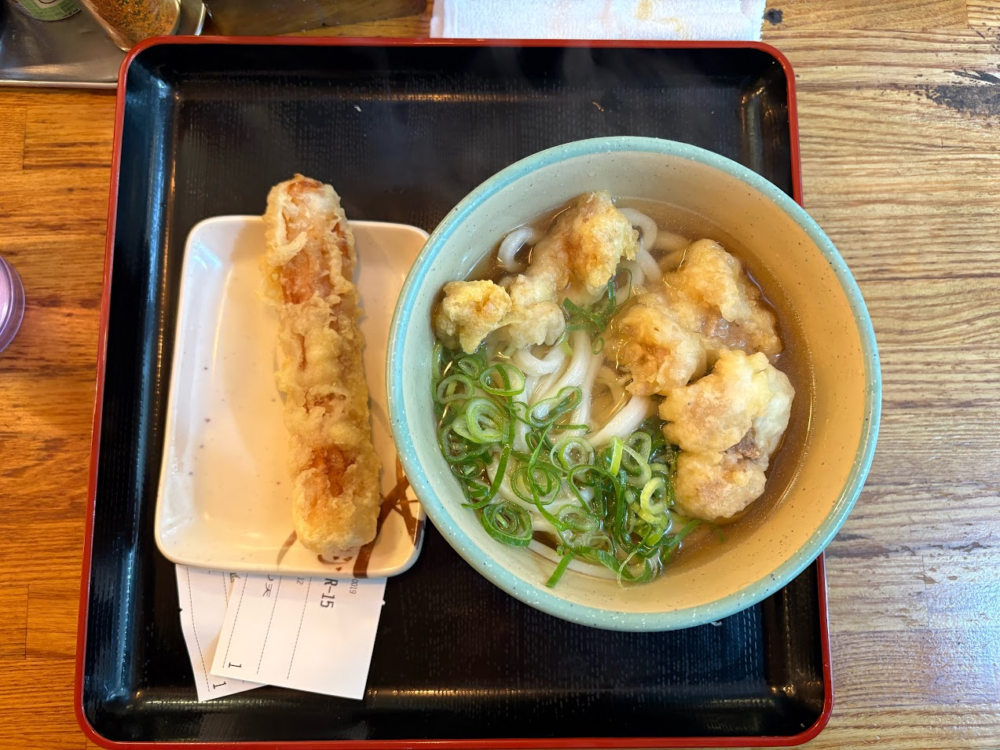
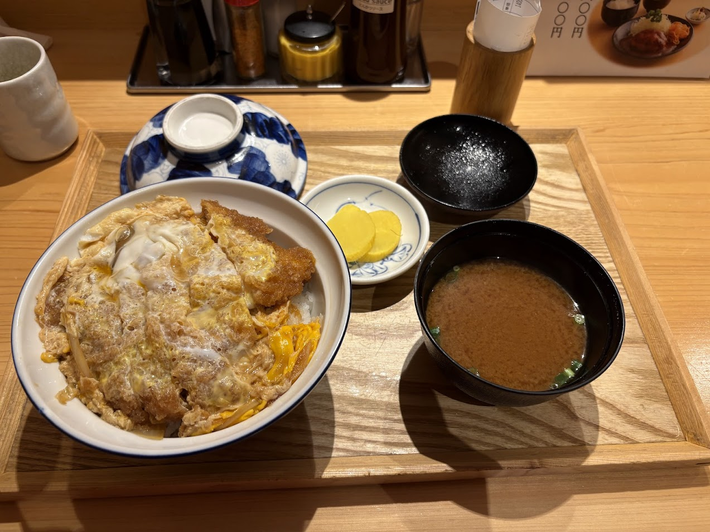
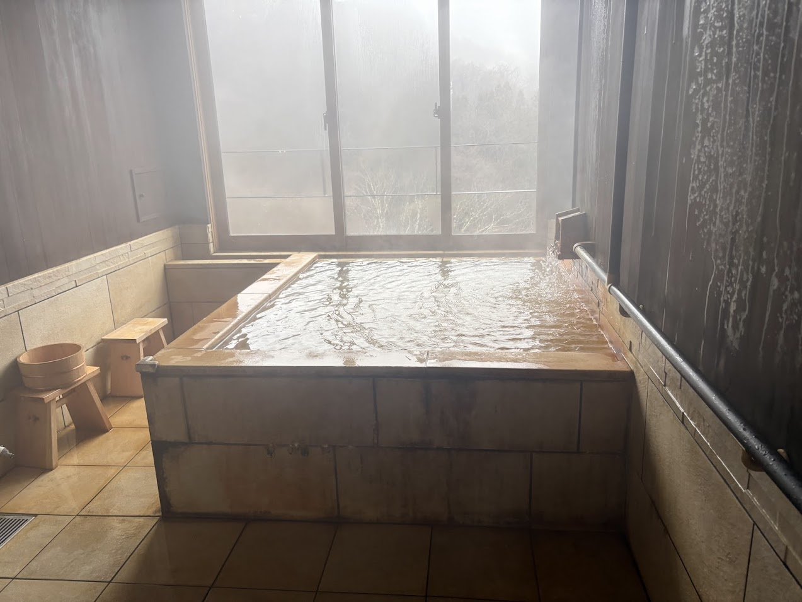
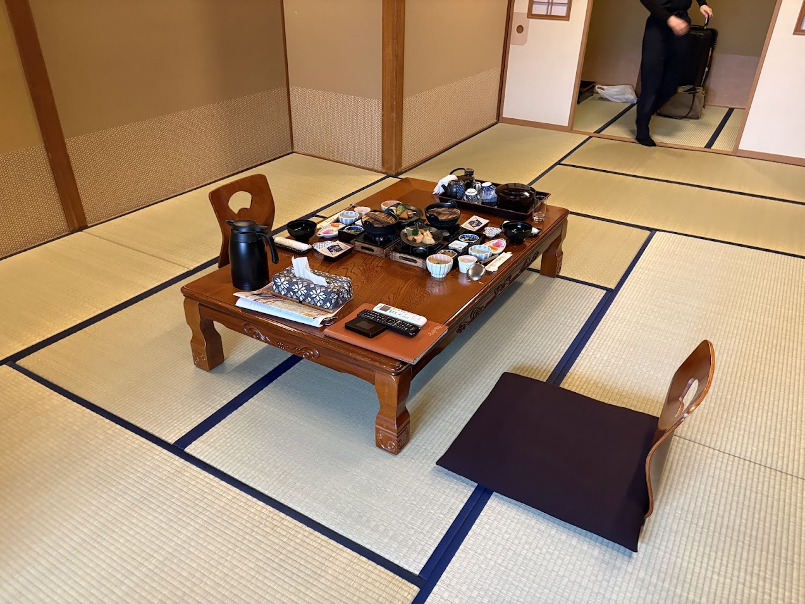
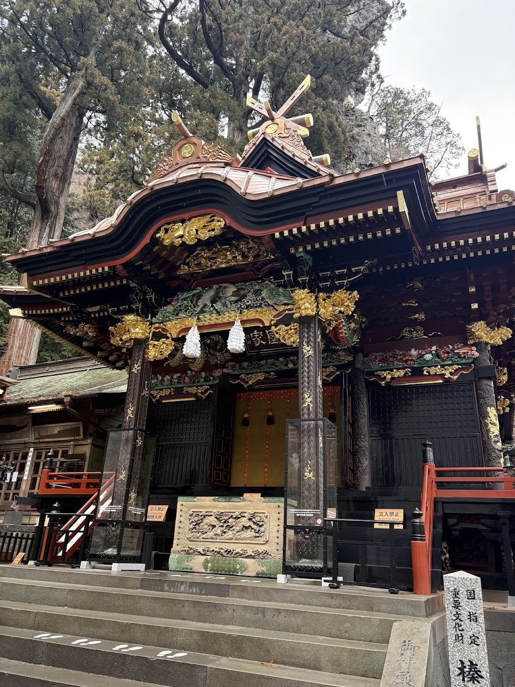

三月は会社の旅行で日本に行っていた。最初の１週間は会社の旅行で、かなり楽しかったし、いろんな人と話せて、あと、日本人一人なのでレストランとのコミュニケーションとかおすすめのラーメン屋とか友達に聞いたりしてシェアしたり美味しいトンカツとか、蕎麦を食べに連れて行ったり、楽しかった。夜は渋谷のバーでみんなで騒いだり、時差ぼけでみんな眠かったり、日本酒飲み比べ体験朝から行って、四人くらいで飲み屋に入って、そのあと、会社のみんなで屋形船で飲んだりも、楽しかった。最後はみんなでカラオケ行ったのも良かった。会社はなんだかんだ楽しい。みんな結構年齢を聞いたりしてて、平均年齢は27歳くらいらしく、考えられないくらいみんな優秀なんだけど、自分一人だけ飛び抜けておっさんだけど、関係なく接してくれるし、会社も今年一気に成長するだろうしやってるプロジェクトめちゃ楽しいので、なんかいい感じだ。

そのあと、一泊だけ実家に行ったら両親は二人とも思ったより元気そうで良かった。そのあとすぐに東京戻って、一人で銀座のホテルに一泊して銀座でカレー食べたり、ダラダラしてた。その次期の日は仲のいい友達を呼び出して表参道で呑んでとても楽しかった。

次の日は妻がニューヨークから直接到着して東京駅で待ち合わせて四万温泉に向かった。浴場が１０種類くらい大きな旅館に泊まってとても良かった。日本式の部屋で浴衣でダラダラして、これがしたかった！という感じだった。次の日は、伊香保に移動。１泊目はとてもいい旅館に泊まった。値段は高くないのに、一番良かった。部屋で夕ご飯も食べて最高。その次の日は朝から違う旅館に移動して、榛名神社に行った。これもとても良かった。という感じで純日本な三日間を楽しんでそのままニューヨークに帰ってきた。

それにしてもこの時期に日本に行くのは本当にやめた方がいい。スギ花粉でひたすら痒くて死にそうだった。

そんなこんなで帰ってきてからは7時に起きてすぐ仕事して会社行って11まで仕事して寝て、っていうのを繰り返してるだけの日々。

---

