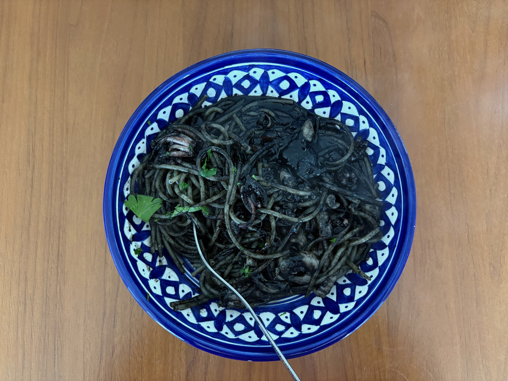
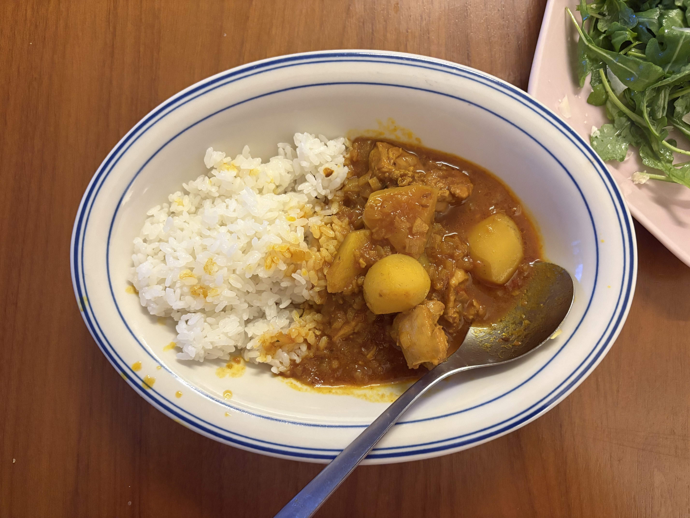
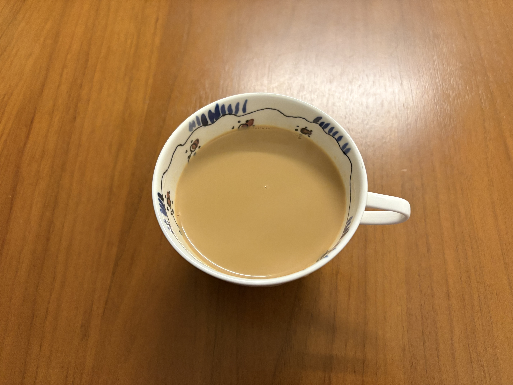

さて。全然日記書いていない。今日はニューヨークは33度。最近本当に暑い日が多い。家でずっと趣味のコードを書いていた。相変わらずvibeコーディング中毒のまま。

日本に行く前に始まった会社のプロジェクトは社長直々に一番大事なプロジェクトだからと言われて自然にリーダーになってチームで仕事した。と言ってもレンダリングエンジンの経験のある二人のチームでその後1人増えて3人になったけど小さなチームで、完全にAIドリブンで普通なら2年かかると言われていた仕事を2ヶ月で完成まで持っていって、みんなから褒められてとても満足のいく結果に終わった。そこからすぐに次の仕事にスライドして無限に続くけど、このプロジェクトはここ10年くらいでも最も納得のいくプロジェクトの一つになった。
おかげでめちゃくちゃAIのハーネスとかに詳しくなったし、異常に高い生産性を維持できている。最近はもっぱらpi-coding-agentというneovimみたいなagentでたくさんの武器を毎日製造しながら日々戦っているっていう感じ。この宮大工みたいなやり方が最近とても好き。仕事前に専用のカンナを作る感じ。ここ数ヶ月前まで自分の仕事は最早なくなるのではと思っていたけど、AGIが来るだの、そういったAIの会社の誇大広告にも惑わされることもなくなり、AIはまだ、ただただ優秀な計算機のようなものだということが今の感覚。もうちょっと自分の仕事は非常に楽しい無双のような状態が続きそう。

それでも、意識というものについてとか、思考というものについて、日々ずっと考えている。AIと毎日相対しているだけでも普通に意識というものを感じる以上、自分の感覚では意識というものは、ただただ表層に現れる現象の見え方でしかないというか、あまり気にする価値のないものだと思っている。スティーブンウルフラムもこの前ツイートしていたけど、意識なんてものについてもはや学問する意味などないのだろうという気はしている。

そして思考に関しては、GPTというのは多分計算量を大幅に減らしてパラメータ数を異常にアップした状態で現在存在するGPU上で動くようにするために開発された構造なのだろうと思うんだけど、そのGPTが発明されて、ある固定されたパラメータ値において人間の脳をすばらしいまでにシミュレートしている理由をまだ科学は理解できていない、そして理解する必要もないのかと感じているけど、あと一つこの上に大きな発見もしくは発明が重なると本当にAGI的なものに達するのだろうと思うけど、現在のAIとそれには大きな隔たりがあって、それを見ているとまだまだ安心できる。けどAIは本当にすごい、仕事の質も量も圧倒的に上がっている。でも、このままでは自分が馬鹿になる。記憶だけでなくCPUまで外部に委譲してしまってるのだから。

そんなこんなで仕事は楽しくやっている。運動はしていない。英語はかなり上達してきた。でもまだまだ。自分に自信があるけど自信がないという状態を続けている。