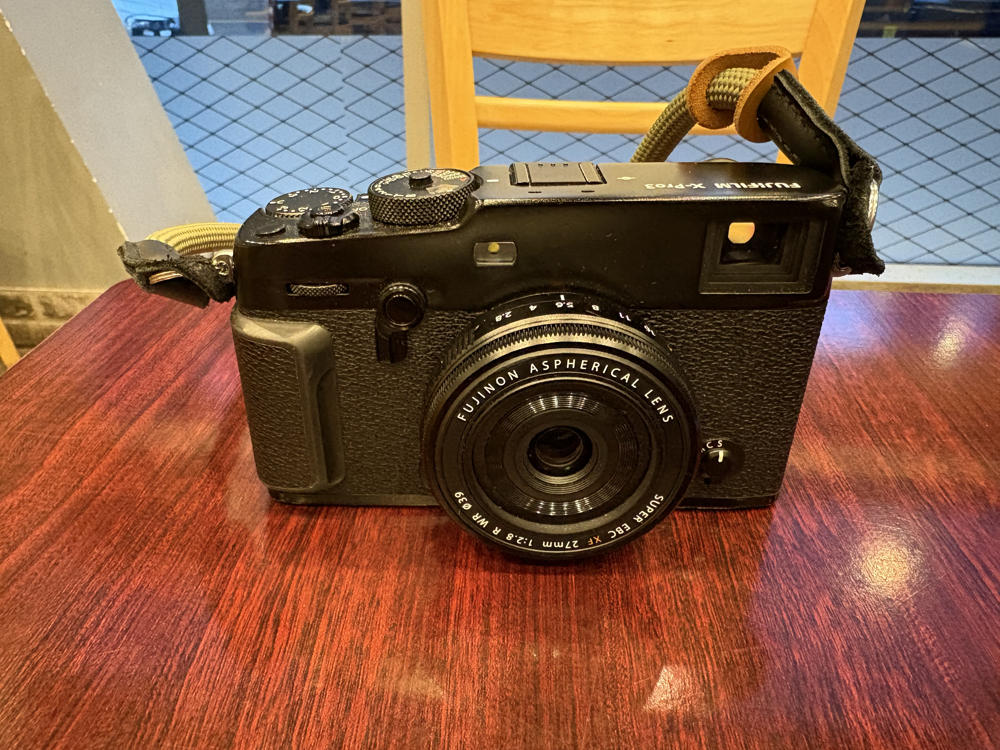
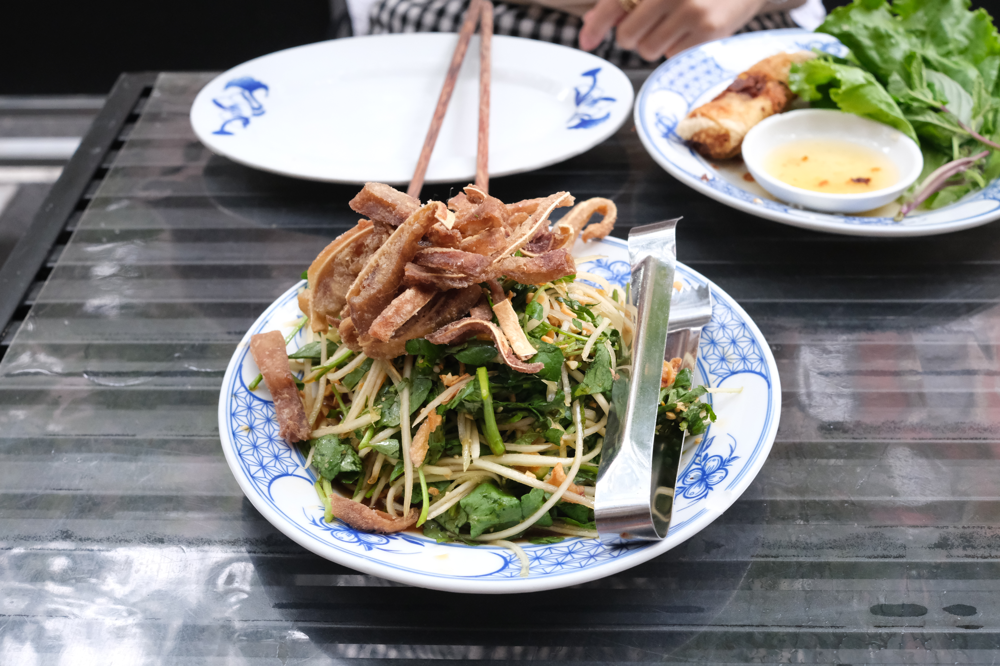

さてさて久しぶりの日記。ひたすら働きまくって数日前から2週間の夏休みをとっている。あしたからポルトガルとフランスに10日間観光しに行ってくる。

会社で2月にレンダリングエンジンのプロジェクトが始まってリーダーになった。前の会社で全く同じことをやったのでノウハウもあればどういうデザイんがこの会社には合っているかなどすぐにベストなものにたどりつくこともできた。
前の会社でのプロジェクトはRustエキスパートたちで1年半かかった。今回は二人で3ヶ月でできないかやってみよう、という野心的かつ会社の未来を左右するようなプロジェクトでリーダーをしてとてもやりがいがあって、最初の週から週末も全部働いていた。めちゃくちゃ楽しくてずっとやっていて結局2ヶ月で古いレンダリングエンジンとフル互換でマルチプラットフォームとテストカバー率100%でレンダリングテストも完璧にカバーした状態を完成させることができた。

CEOにも褒められたし、会社の前進を一気に早めることができたし、みんなもとても褒めてくれたので、非常にやりがいのあったプロジェクトだった。でも、切れ目なく次のプロジェクトにスライドしたので、休む暇もなく、ワーカホリック状態のまま6ヶ月進み続けて、平均で言えば一日14時間は働いていたと思う。週末もあまり休まずやっていたし、でも、楽しかったから、まぁ問題なかったんだけど、やっと2週間を休みを取ったので、数日前から本当にゆっくりしている。AIとも向き合わず、この2週間はアナログに過ごそうと思う。

AIを使ったエクストリームな開発で、今までやったことのないやり方だったし、学ぶことも沢山あったけど、昔ながらのコードを書く感じを忘れてしまいつつあるとこをどう捉えるべきか、まだ判断付けずにここまで来てしまったので、そういうのも考えてみたい。

自分へのご褒美にカメラを買った。

